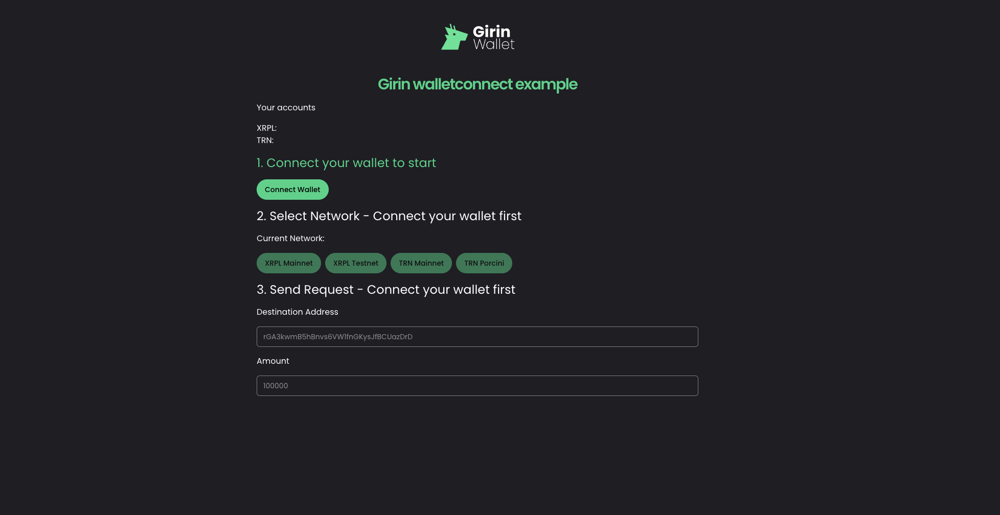

## Getting Started

GirinWallet supports XRPL and The Root Network via WalletConnect v2.

- XRPL Specs : https://docs.reown.com/advanced/multichain/rpc-reference/xrpl-rpc
  - Support networks : `xrpl:0` (mainnet), `xprl:1` (testnet)
  - Support methods : `xrpl_signTranscation`
- The Root Network Specs : https://docs.reown.com/advanced/multichain/rpc-reference/ethereum-rpc
  - Support networks : `eip155:7668` (mainnet), `eip155:7672` (porcini testnet)
  - Support method : `personal_sign`, `eth_sendTransaction`


## Integration

### Install
This example is constructed using the libraries below. You can also implement it by referring to the official WalletConnect v2 documentation.

```bash
yarn add @walletconnect/modal-sign-react @walletconnect/types @walletconnect/utils ethers
```

### Connect

Connect your iOS or Android wallet by scanning a QR code. Connect through the namespace you need to connect to and get account information.


```ts
import { useConnect } from '@walletconnect/modal-sign-react';

import { Button } from '@/components/ui/button';

export function Connect() {
  const { connect, loading: isConnecting } = useConnect({
    requiredNamespaces: {
      xrpl: {
        chains: ['xrpl:0', 'xrpl:1'],
        methods: ['xrpl_signTransaction'],
        events: ['chainChanged', 'accountsChanged'],
      },
      eip155: {
        chains: ['eip155:7668', 'eip155:7672'],
        methods: ['eth_sendTransaction', 'personal_sign'],
        events: ['chainChanged', 'accountsChanged'],
      },
    },
  });

  async function onConnect() {
    try {
      const session = await connect();
      console.info('connect result', session);
    } catch (err) {
      console.error(err);
    }
  }
  return (
    <Button
      size="default"
      onClick={onConnect}
      disabled={isConnecting}
      className="w-fit"
    >
      Connect Wallet
    </Button>
  );
}
```

### Disconnect
Disconnect from GirinWallet.

```ts
import { useDisconnect } from '@walletconnect/modal-sign-react';
import { getSdkError } from '@walletconnect/utils';
import { SessionTypes } from '@walletconnect/types';

import { Button } from '@/components/ui/button';

export function Disconnect({ session }: { session: SessionTypes.Struct }) {
  const { disconnect, loading: isDisconnecting } = useDisconnect({
    topic: session.topic,
    reason: getSdkError('USER_DISCONNECTED'),
  });

  const onDisconnect = async () => {
    try {
      await disconnect();
      console.info('disconnected');
    } catch (err) {
      console.error(err);
    }
  };

  return (
    <Button onClick={onDisconnect} disabled={isDisconnecting} className="w-fit">
      Disconnect Wallet
    </Button>
  );
}
```

### SendTransaction

Below is an example of how to send a transaction to XRPL, TheRootNetwork. For detailed response, please check the XRPL, EVM specs in WalletConnect V2.

```ts
'use client';

import { useRequest } from '@walletconnect/modal-sign-react';

import { Button } from '@/components/ui/button';

import { NETWORK, NETWORK_MAP } from '@/lib/network';

interface Props {
  topic: string;
  account: string;
  network: NETWORK;
  amount: string;
  destination: string;
}

// TODO
type XrplSignTransactionResponse = unknown;
type TrnSendTransactionResponse = unknown;

export function Send({ topic, network, account, amount, destination }: Props) {
  const isXrpl = network.startsWith('xrpl');

  // https://docs.reown.com/advanced/multichain/rpc-reference/xrpl-rpc#xrpl_signtransaction
  const { request: xrplSendTransaction } =
    useRequest<XrplSignTransactionResponse>({
      chainId: network, // xrpl:0, xrpl:1
      topic, // session.topic
      request: {
        method: 'xrpl_signTransaction',
        params: {
          tx_json: {
            TransactionType: 'Payment',
            Account: account,
            Destination: destination,
            Amount: amount,
          },
        },
      },
    });

  // https://docs.reown.com/advanced/multichain/rpc-reference/ethereum-rpc#example-parameters-1
  const { request: trnSendTransaction } =
    useRequest<TrnSendTransactionResponse>({
      chainId: network, // eip155:7668, eip155:7672
      topic, // session.topic
      request: {
        method: 'eth_sendTransaction',
        params: [
          {
            from: account,
            to: destination,
            gasPrice: '0x029104e28c',
            gas: '0x5208',
            value: '0x' + BigInt(amount).toString(16),
            data: '0x',
          },
        ],
      },
    });

  const onSendTransaction = async () => {
    const sendTransaction = isXrpl ? xrplSendTransaction : trnSendTransaction;

    try {
      const result = await sendTransaction();
      console.info('sendTransaction result', result);
    } catch (err) {
      console.error(err);
    }
  };

  return (
    <Button
      className="w-fit"
      onClick={onSendTransaction}
      disabled={!account || !amount || !destination}
    >{`${isXrpl ? 'xrpl_signTransaction' : 'eth_sendTransaction'} to ${NETWORK_MAP[network]}`}</Button>
  );
}
```

### personal_sign

See the example below to see how to do personal_sign on TheRootNetwork. For more detailed answers, please check the EVM specs of WalletConnect V2.

```ts
'use client';

import { useRequest } from '@walletconnect/modal-sign-react';

import { Button } from '@/components/ui/button';

import { NETWORK, NETWORK_MAP } from '@/lib/network';

interface Props {
  topic: string;
  account: string;
  network: NETWORK;
}

// TODO
type Response = unknown;

export function Sign({ topic, network, account }: Props) {
  // https://docs.reown.com/advanced/multichain/rpc-reference/ethereum-rpc#personal_sign
  const { request: signMessage } = useRequest<Response>({
    chainId: network, // eip155:7668, eip155:7672
    topic,
    request: {
      method: 'personal_sign',
      params: ['Hello World', account],
    },
  });

  const onSign = async () => {
    try {
      const data = await signMessage();
      console.info('sign result', data);
    } catch (err) {
      console.error(err);
    }
  };

  return (
    <Button
      className="w-fit"
      onClick={onSign}
    >{`personal_Sign to ${NETWORK_MAP[network]}`}</Button>
  );
}
```

## Example

You can easily conduct integration tests with GirinWallet through the examples below.



- Demo : https://walletconnect-example.netlify.app/
- Source : https://github.com/girin-app/girin-walletconnect-example

```bash
yarn
yarn dev
#Open [http://localhost:3000](http://localhost:3000) with your browser to see the result.
```